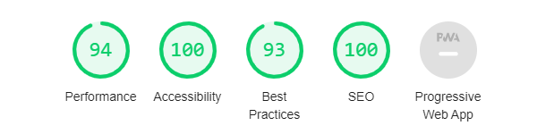

# **Prefeitura Municipal de Rio Claro - RJ - Site**

## **Overview**
Implementation of the UI redesign that was presented at [**Behance**](https://www.behance.net/gallery/80414855/Redesign-Rio-Claro-City-Hall-Website) developed for study purposes for Rio Claro City Hall in the State of Rio Janeiro. The original site done in [**WordPress**](https://wordpress.org/) and is online at [**rioclaro.rj.gov.br**](https://rioclaro.rj.gov.br/) and  the new concept being developed in **[Angular](https://angular.io/)** and you can see the redesign version [**here**](https://miguelsmuller.github.io/pmrc-site/).

- **Available for consultation and study only**

- Feature 1
- Feature 2
- Feature 3

|[See Demonstration](https://prefeitura-rioclaro.web.app/) |
|:---------------------------------------------------:|

 

### **Behance Case Study** 
The redesign concept presented in this project was presented in
[**Behance**](https://www.behance.net/gallery/80414855/Redesign-Rio-Claro-City-Hall-Website) 

- **Available for consultation and study only**

 

### **DevTools Lighthouse Score** 

 

## **Project Requirements**  
Make sure that you also have **[NodeJS](https://nodejs.org/)** and **[NPM](https://www.npmjs.com/)** installed on your computer.
- `$ node --version` and `$ npm --version`

 

**Install dependencies** of project with:  
- `$ npm install`

 

**Angular Cli** is already part of the development dependencies, so any cli functionality can be used with the prefix npx.

- `$ npx ng serve`

 

**First Execution - Environment files**: In the first execution of the project, it is **essential** to create the environment files (_environment.ts_) in _/src/environments_ according to the model that follows inside the folder (_environment.exp.ts_).

 

## **Workflow**  
**[WORKFLOW.md](WORKFLOW.md)** - This project uses the workflow pattern called `git flow`.
- [Atlassian - Comparing Workflows](https://www.atlassian.com/br/git/tutorials/comparing-workflows/gitflow-workflow)
- [Difference between workflows](https://www.zup.com.br/blog/git-workflow)
- [Girflow Cheatsheet](https://danielkummer.github.io/git-flow-cheatsheet/index.pt_BR.html)

 

## **Tests**  
[Need to be implemented]

 

## **Deploy**  
**[GITHUB ACTIONS](https://github.com/miguelsmuller/site-prefeitura-rioclaro/actions/workflows/push-to-gh-pages.yml)** - To deploy to a demonstration of project hosted in GitHub Pages.

 

## **Contributing**  
**[CONTRIBUTING.md](CONTRIBUTING.md)** - Specifications of how the contribution should be submitted

 

## **Changelog**  
**[CHANGELOG.md](CHANGELOG.md)** - Chronologically list of changes for each version of a project

 

## **Screenshot**

